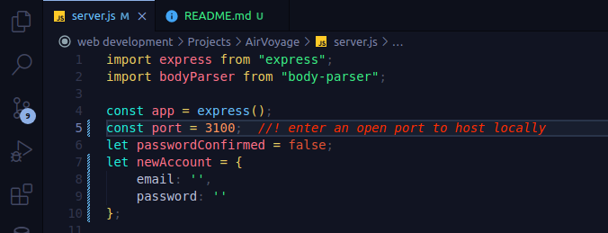

# Air Voyage

## Description
A prototype of a travel webapp called Air Voyage, where the user can find and manege his flights, stays and plan trips in one place.

## Languages and Frameworks
+ Express.js
+ Bootstrap

## Host locally
To host locally go to the 'sever.js' file and change the `port` variable to an open port on your machine. Run the file using node `node server.js`. then open your browser and type 'localhost:' followed with the open port you entered.

## Features
+ User can creat an account and login.
+ Search for stays and explore more about the destination.
+ Search for flights.
+ Keep track of flights.

### To keep in mind
the webapp has no API and no database, it has only a server code so the features are not functional.